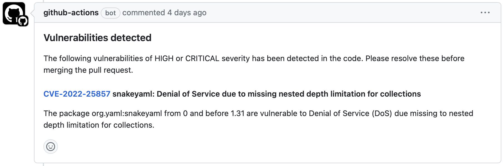

# trivy-pr-report

Fail the build if security vulnerabilities of HIGH or CRITICAL severity is discovered in the code, and adds a Trivy report as a comment to the pull request. For example:



Input parameters are intentionally limited. Use Trivy configuration files along with `.trivyignore` for controlling Trivy operation.

## Usage

```yaml
on:
  pull_request:
    branches: [ main ]
…
permissions:
  contents: read # for actions/checkout to fetch code
  pull-requests: write # required for adding pull request comments
…
steps:
- name: Trivy Scan and Report to PR
  uses: domstolene/trivy-pr-report@v1
  with:
    github_token: ${{ github.token }}
```
